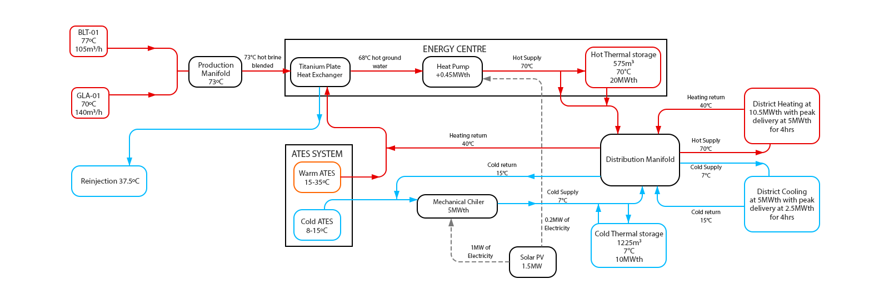

# SPE Africa Geothermal Datathon 2026 — Team GeoLogic Analytics

## Project Title

**Transmissivity-Aware Geothermal District Energy System for Utrecht, Netherlands**

A transmissivity-aware geothermal doublet with ATES seasonal storage, buffer tanks, heat-pump upgrading, solar-powered mechanical cooling, and uncertainty-aware economics.

## Team

**Team GeoLogic Analytics** — SPE Africa Geothermal Datathon 2026

| Name | SPE Member ID |
|------|---------------|
| Uadia Moses Imoukhedeh | 5174626 |
| Ogundimu Samuel Oluwaseun | 5408045 |
| Akanmu Oluwaseun Emmanuel | 5436014 |
| Adejor Friday Emmanuel | 5510461 |
| Favour Ifeanyichukwu Ogboi | 5898562 |

## Presentation Video

[](https://drive.google.com/file/d/1rbiMy7kFRNnisNeSCCH8tyK1UoGojisF/view?usp=sharing)

## Problem Statement

Design an integrated geothermal district energy system for the Utrecht region (Netherlands) delivering:
- **10 MW district heating** (system delivers 10.5 MWth)
- **5 MW district cooling** (system delivers 5.0 MWth)

using medium-temperature resources from the Upper Rotliegend (Slochteren) formation.

## System Architecture Summary



**Subsurface (geothermal doublet + reinjection):**
- Production: BLT-01 (77°C, 105 m³/h) + GLA-01 (70°C, 140 m³/h), blended to 73°C at 245 m³/h
- Reinjection: REINJ-01 high-transmissivity corridor (31.1 Dm), brine returned at 37.5°C
- Gross geothermal power: ~10.05 MWth

**Surface facilities:**
- Titanium plate heat exchanger (hydraulic separation, corrosion resistance)
- Heat pump: upgrades 68→70°C, 0.45 MWth, COP ~2.25, 0.2 MW solar
- Mechanical compression chiller: 5.0 MWth cooling, 1.0 MW
- Hot buffer tank: 575 m³, 20 MWh (5 MWth peak / 4 hrs)
- Cold buffer tank: 1225 m³, 10 MWh (2.5 MWth peak / 4 hrs)
- ATES seasonal storage: warm well 15–35°C, cold well 8–15°C
- Solar PV: 1.5 MW (powers heat pump + chiller, 0.3 MW surplus)

**Economics:**
- Total CAPEX: ~€41.0M (depth-based drilling for 5 wells + surface + solar)
- LCoE: ~€74/MWh (within EU district-heating range)
- Monte Carlo P10/P50/P90 uncertainty analysis

## Repository Structure

```
africa-geothermal-datathon-2026/
├── README.md
├── OUTSTANDING_ITEMS.md             # submission checklist
├── surface-design.png               # updated surface facilities design diagram
├── requirements.txt
├── main.py                          # runs all notebooks end-to-end
├── LICENSE
│
├── data/
│   ├── raw/                         # competition data + LCOE template
│   │   ├── BLT-01.las, EVD-01.las, JUT-01.las, PKP-01.las
│   │   ├── ThermoGIS_Data.xlsx
│   │   ├── Lithostratigraphic_Data.xlsx
│   │   ├── Well_Path_Data.xlsx
│   │   ├── target_lithologies.csv
│   │   └── LCOE.xlsx
│   ├── processed/                   # cleaned outputs from notebooks
│   │   ├── cleaned_well_logs.csv
│   │   ├── processed_thermogis_data.csv
│   │   ├── geothermal_screening_summary.csv
│   │   └── target_lithologies_corrected.csv
│   └── thermogis_exports/
│       └── thermogis_screenshots/
│           ├── gla01_thermogis_properties.jpg
│           └── reinj01_thermogis_transmissivity_map.jpg
│
├── notebooks/
│   ├── 01_geothermal_resource_assessment.ipynb
│   ├── 02_integrated_energy_system_design.ipynb
│   └── 03_economic_and_ai_workflow.ipynb
│
├── outputs/
│   ├── figures/                     # 11 visualisations (.png)
│   └── tables/                      # 8 summary tables (.csv)
│
├── presentation_assets/
│   ├── workflow_diagrams/
│   │   ├── surface-design.png
│   │   └── system_architecture_handdrawn.jpg
│   ├── report_figures/              # key figures for slides
│   └── slide_exports/               # final presentation slides
│       └── Team_GeoLogicAnalytics_PPT_V1.pptx
│
└── docs/
    ├── methodology_notes.md
    ├── assumptions_and_limitations.md
    ├── Surface_Facilities_Design_Report.docx
    └── thermodynamic_calculations/  # handwritten calc evidence
        ├── 01_cooling_heating_flow_calc.jpg
        ├── 02_brine_blending_calc.jpg
        ├── 03_total_power_reinjection_calc.jpg
        ├── 04_outlet_temp_calc.jpg
        └── 05_heat_pump_district_power_calc.jpg
```

## Notebook Workflow

1. **01 — Geothermal Resource Assessment:** LAS ingestion, QC, TVD validation, lithostratigraphy, ThermoGIS screening, well ranking, injection well selection (REINJ-01), final architecture
2. **02 — Integrated Energy System Design:** brine blending (73°C), heat exchanger, heat pump, chiller, ATES, buffer tanks, demand modelling, dispatch — matching the Surface Facilities Design Report
3. **03 — Economic Analysis & Uncertainty:** depth-based drilling costs (5 wells), CAPEX/OPEX, LCoE, tornado sensitivity, Monte Carlo uncertainty, scenario comparison

## Reproduce

```bash
pip install -r requirements.txt
python main.py
```

Or run notebooks individually in order (01 → 02 → 03).

## Key Engineering Findings

1. **Transmissivity > temperature** for geothermal viability (PKP-01: 88°C but 0.1 Dm → non-viable)
2. **GLA-01 corridor** (15.2 Dm) and **REINJ-01** (31.1 Dm) found via ThermoGIS scouting outperform official wells
3. Gross geothermal **10.05 MWth** plus 0.45 MWth heat-pump upgrade meets the 10.5 MWth heating target
4. **Cooling needs higher flow** (540 m³/h vs 245 m³/h brine production) due to lower ΔT
5. **Solar PV** covers all heat-pump and chiller electrical loads
6. LCoE competitive with EU district-heating benchmarks

## External Data Sources

- **ThermoGIS** (thermogis.nl) — supplementary well scouting and corridor optimisation
- **TNO LCOE Framework** — adapted for integrated district energy economics
